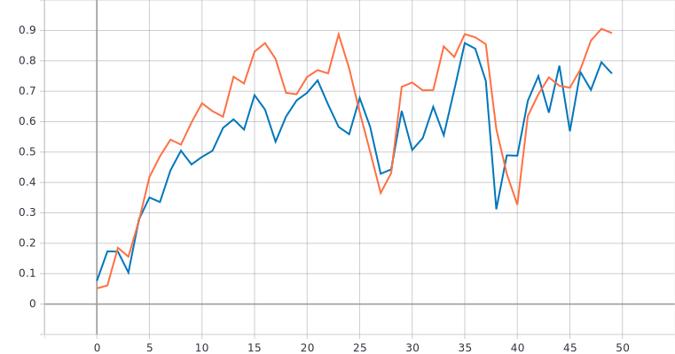
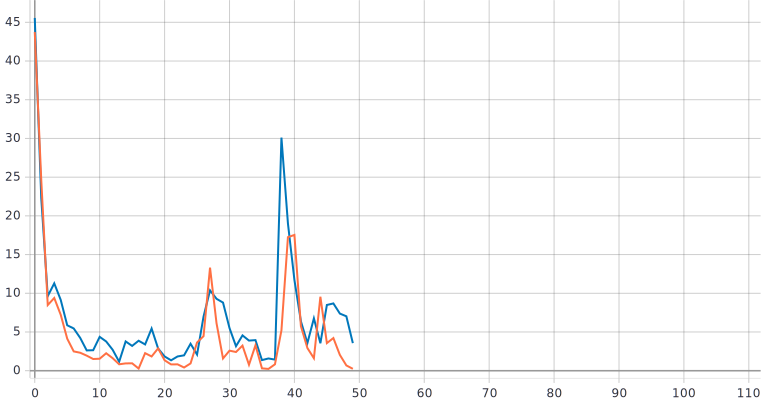

# С использованием примера [1] обучить предоставленную реализацию нейронной сети для решения задачи классификации изображений Oregon WildLife


- Описание архитектуры:
  Создаём тензор
```
inputs = tf.keras.Input(shape=(RESIZE_TO, RESIZE_TO, 3))
```
Свёрточный слой с 8-ю фильтрами и ядром(матрица 3X3)

```
x = tf.keras.layers.Conv2D(filters=8, kernel_size=3)(inputs)
```

Уменьшаем дискретизацию данных выбором максимального значения
```
 x = tf.keras.layers.MaxPool2D()(x)
```

Переводим многомерный тензор в одномерный
```
 x = tf.keras.layers.Flatten()(x)
```

Приводим результат к вероятностному виду при помощи полносвязного слоя с 20 выходами и функции активации softmax
```
 outputs = tf.keras.layers.Dense(NUM_CLASSES, activation=tf.keras.activations.softmax)(x)
```

-Графики обучения:
 - Валидация - синий цвет
 - Тренировка - оранжевый цвет

  
  
  
